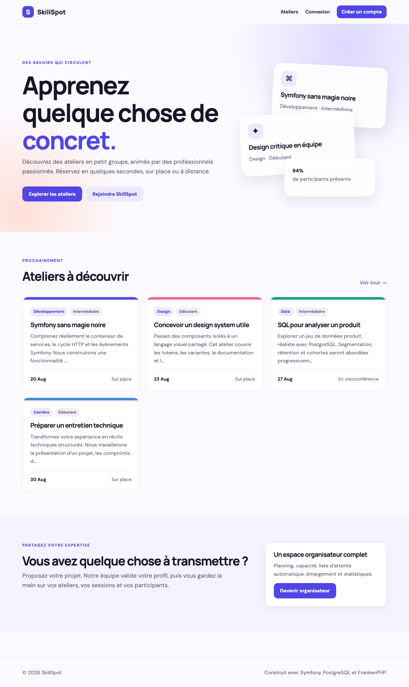
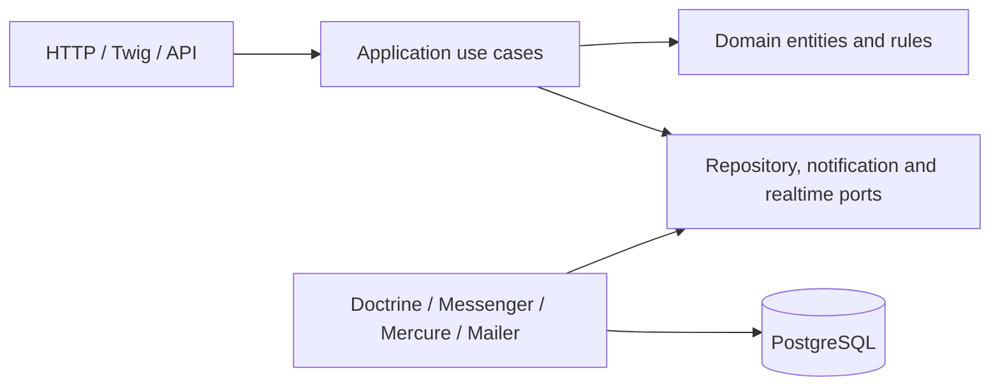

# SkillSpot

[](../../actions/workflows/ci.yml)

SkillSpot is a full-stack Symfony platform for discovering and booking free workshops. It was built as a portfolio project to demonstrate business-oriented backend design, server-rendered UX, testing, asynchronous processing and production-ready Docker practices.



## What it demonstrates

- A public, filterable workshop catalogue built with Twig Components, Turbo, Stimulus and custom responsive CSS.
- Verified accounts with password reset, role-based workspaces, voters and a reviewed organizer application workflow.
- Transactional booking rules: capacity, schedule conflicts, a 24-hour cancellation deadline and FIFO waitlist promotion.
- Organizer tools for sessions, participants, attendance and computed performance metrics.
- Async e-mails and failed-message handling with Messenger, scheduled reminders with Scheduler, and live public availability with Mercure.
- A read-only API Platform API backed by dedicated output resources instead of Doctrine entities.
- PostgreSQL migrations, deterministic demo fixtures, PHPUnit, PHPStan at maximum level and PHP-CS-Fixer.
- A multi-stage FrankenPHP image, separate web/worker/scheduler containers and GitHub Actions CI.

## Architecture

The application is a modular monolith. Business modules are split into `Domain`, `Application`, `Infrastructure` and `UI`; controllers adapt HTTP and delegate to focused use cases.



The booking transaction locks its session row before reading capacity. A PostgreSQL trigger takes the same lock and rejects confirmations above capacity, protecting the invariant even from writers outside the application. Seat assignment and FIFO promotion therefore remain consistent under concurrent requests; notifications and Mercure updates are dispatched only after the business operation succeeds.

## Business rules

- One active booking per attendee and session.
- Active confirmed or waitlisted bookings may not overlap.
- A free seat confirms immediately; otherwise the attendee joins a FIFO waitlist.
- Attendees may cancel until exactly 24 hours before the session.
- Cancelling a confirmed seat promotes the oldest waitlisted booking atomically.
- A workshop cannot be published without a future, bookable session.
- Only the owning organizer or an administrator can manage a workshop.
- Attendance can only be recorded for confirmed bookings after a session completes.

## Run locally

Requirements: Docker with Compose v2 and `make` (optional).

```bash
docker compose build --pull
docker compose up --wait
docker compose exec php php bin/console doctrine:fixtures:load --no-interaction
```

Open [https://localhost](https://localhost) and accept the development TLS certificate. Mailpit is exposed on the random port displayed by `docker compose ps`.

Demo accounts all use `SkillSpot2026!`:

| Role | E-mail |
| --- | --- |
| Participant | `participant@skillspot.local` |
| Organizer | `organizer@skillspot.local` |
| Administrator | `admin@skillspot.local` |
| Pending organizer applicant | `candidate@skillspot.local` |

Useful commands:

```bash
make qa          # lint, style check, PHPStan and PHPUnit
make reset-db    # recreate the local database and fixtures
make logs        # follow web, worker and scheduler logs
```

Failed asynchronous messages remain in a dedicated transport and can be inspected or retried by an administrator:

```bash
docker compose exec php php bin/console messenger:failed:show --stats
docker compose exec php php bin/console messenger:failed:retry
```

## Public API

Interactive OpenAPI documentation is available at `/api/docs`.

```text
GET /api/workshops?category=development&level=intermediate&mode=online&page=1
GET /api/workshops/{slug}
GET /api/sessions/{id}
GET /healthz
```

The API is intentionally read-only. Booking writes remain protected by the web firewall and CSRF tokens.

## Tests and quality

```bash
docker compose exec php composer lint
docker compose exec php composer cs-check
docker compose exec php composer analyse
docker compose exec php composer test
```

The test suite covers domain invariants, the transactional booking/promotion use cases, authorization and the main BrowserKit user journeys. CI also validates Doctrine mapping, compiles AssetMapper assets and builds the final production image.

## Production deployment

SkillSpot does not provision a cloud server. The repository supplies a production image and Compose topology that can be deployed to any Docker host.

```bash
cp .env.prod.example .env.prod.local
# Replace every placeholder in .env.prod.local.
docker compose --env-file .env.prod.local -f compose.yaml -f compose.prod.yaml up -d --build
```

Production responsibilities outside this repository include DNS, external SMTP credentials, TLS/secret rotation, PostgreSQL backups, log collection and host monitoring. The web container runs migrations once; Messenger and Scheduler use the same immutable image with dedicated commands.

Symfony 8.1 is a standard release supported until January 2027. Dependabot tracks framework, Composer, Docker and GitHub Actions updates so the project can be upgraded before that date.

## License

[MIT](LICENSE)
